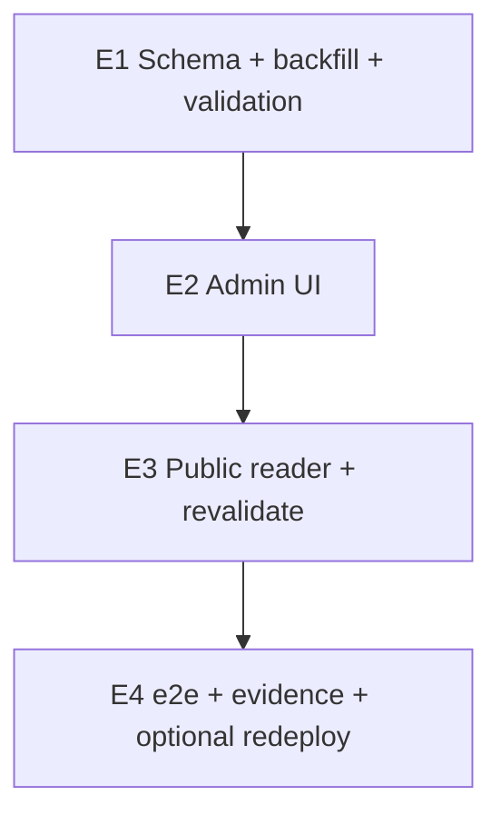

# About CMS enhancement — small implementation sprints

Date: 2026-08-28  
Wayfinder ticket: [Grilling: About enhancement sprint plan sign-off](https://github.com/aiiiinerv-ctrl/kkd_prop_web/issues/85)  
Map: [Map: About page CMS — credentials heading, editable icons](https://github.com/aiiiinerv-ctrl/kkd_prop_web/issues/77)  
Live-verify: [`about-cms-enhancement-live-verification-matrix.md`](about-cms-enhancement-live-verification-matrix.md) (#86)

## Status

**Plan only — do not implement until:**

1. Map #77 closes (this doc + verify matrix committed)
2. Owner sign-off on sprint breakdown (closes #85)
3. Separate execution issue(s) opened — not part of map #77

This document does **not** change schema, code, or production.

## Destination (locked #82–#83)

Admin can edit on About (`/admin/pages/about`):

1. **New:** credentials section title + subtitle before the 3 credential cards (`credSectionTitleTh/En`, `credSectionDescTh/En`)
2. **New:** Lucide allowlist icon per card slot (6 columns; defaults match today’s hardcode)
3. **Wire-up:** existing schema fields — stats row labels (4 pairs) + testimonials title/subtitle — admin UI + public render

**Out:** stats section title (`numbersTitle`), icon upload, card count/layout changes, Sprint 12 shim removal.

## Research pack (inputs)

| Asset | Ticket |
| --- | --- |
| [`about-cms-enhancement-inventory-research.md`](about-cms-enhancement-inventory-research.md) | #78 |
| [`about-cms-enhancement-edge-cases-research.md`](about-cms-enhancement-edge-cases-research.md) | #79 |
| [`about-cms-enhancement-impact-research.md`](about-cms-enhancement-impact-research.md) | #80 |
| [`about-cms-enhancement-security-research.md`](about-cms-enhancement-security-research.md) | #81 |
| [`about-cms-enhancement-grilling-decisions.md`](about-cms-enhancement-grilling-decisions.md) | #82–#83 |
| Prototype: [`assets/about-cms-enhancement-prototype/`](assets/about-cms-enhancement-prototype/) | #84 |

Mother context: Sprint 6 About (#69) · [`pages-cms-sprint6-about-tasks.md`](pages-cms-sprint6-about-tasks.md) · ownership doc (amend at E2 for icons).

## Locked decisions (no re-litigation in exec)

| Topic | Decision |
| --- | --- |
| Icon model | Lucide allowlist enum — six nullable `VARCHAR` columns; public static map; no dynamic import |
| Credentials heading | Optional when `showCredentials=true` — empty = cards only (edge S2) |
| New text validation | `optionalPlainMetaText` for cred section heading fields |
| Stats section title | **Not** added to AboutContent |
| Sprint 12 (#76) | Parallel-safe; do not remove 307 shims in this effort |
| Observation window | Keep whole-record message fallback when row absent |

## Sign-off (#85)

- [ ] Owner accepts E1–E4 breakdown and rollback posture
- [ ] Owner reviewed prototype (#84) — credentials heading + icon picker UX
- [ ] Owner accepts live-verify matrix (#86) as execution acceptance contract

Agent committed plan 2026-08-28; owner checkbox closes execution gate.

## Non-negotiables

- Additive DDL only — preserve `AboutContent.id` (Sprint 6 rule)
- TH+EN on every new/admin-wired field; public EN → TH via `pickLocale`
- Extend `ABOUT_FIELDS` explicitly — no FormData spread / mass-assign
- `requireRole` + `canManageContent` + `auditedAggregate` + optimistic `version`
- Invalid icon key → reject save; null/empty → slot default on public
- `revalidatePath` via existing aggregate on success only
- Before each exec sprint: short **before-fix summary**; after: **after-fix summary**
- Live-verify per matrix; stop on first failed gate

## Before-fix summary (whole enhancement)

| Layer | Change |
| --- | --- |
| DB | +4 cred heading columns; +6 icon columns; stats/testimonial label columns already exist |
| Backfill | Idempotent: heading null (public unchanged); icons null → code defaults |
| Validation | New heading: `optionalPlainMetaText`; icons: zod enum allowlist |
| Action | Extend `ABOUT_FIELDS`, zod schema, audit snapshot |
| View | `AboutContentView` + stats label exports; icon keys |
| Admin | Cred section heading block; icon `<Select>` ×6; stats/testimonials text fields |
| Public | `SectionHeading` before credentials; dynamic Lucide map; `StatsRow` label overrides |
| Docs | Amend `pages-cms-content-ownership-decisions.md` (icons admin-selectable within allowlist) |
| Tests | e2e save cred heading + icon + stats label; public assert |
| Deploy | Routine incremental redeploy; DDL before or with deploy |

**Explicitly not changing:** hero/team card copy patterns, featured testimonial logic, Page Properties SEO, other pages, Home `StatsRow` message defaults when called elsewhere (About-only overrides).

## Dependency map

Independent of Sprint 12 calendar (2026-09-11). Avoid merging E3 with Sprint 12 shim PR — same file `about/page.tsx`.

---

## Sprint E1 — Additive schema + backfill + validation

**Outcome:** DB and server accept new fields; public site unchanged (null columns + code fallbacks).

### Scope

| Item | Detail |
| --- | --- |
| DDL | `credSectionTitleTh/En`, `credSectionDescTh/En`; `credRegisteredIcon`, `credEngineerIcon`, `credExperienceIcon`, `teamDesignIcon`, `teamInstallIcon`, `teamSupportIcon` (names TBD — match Prisma convention) |
| Migration | `prisma migrate dev`; prod hand SQL note |
| Backfill | Extend `pages-cms-sprint3.ts` — heading null; icons null |
| Validation | `optionalPlainMetaText` for heading; icon enum in `about-content.ts` zod |
| Action | Add fields to `ABOUT_FIELDS` (no UI yet) |

### DoD

- [ ] Migration applies 2× idempotently on local MySQL
- [ ] Backfill digest stable 2×; public `/th/about` + `/en/about` match baseline screenshots
- [ ] Unit-level: invalid icon rejected by zod; valid null accepted
- [ ] No admin/public UI changes in E1 (avoid half-wired UX)

### Rollback

Revert migration if deploy blocked; old app ignores new columns.

### Live-verify

Schema/backfill evidence only (matrix §A). No web-view UX change expected.

---

## Sprint E2 — Admin UI

**Outcome:** `/admin/pages/about` exposes cred section heading, six icon pickers, stats labels, testimonials chrome fields.

### Scope

| Item | Detail |
| --- | --- |
| `about-client.tsx` | Section “หัวข้อก่อนการ์ดจดทะเบียน” TH+EN tabs; icon `<Select>` per slot (allowlist labels); stats 4 labels; testimonials title/subtitle |
| `about-admin-shell.tsx` | Pass new props if needed |
| UX | Match prototype #84; helper text for optional heading + icon defaults |
| Docs | Amend ownership doc — icons editable within allowlist |

### DoD

- [ ] Save persists all new fields; audit diff readable (icon strings only)
- [ ] Invalid icon rejected with toast/error; no partial DB write
- [ ] TH+EN tab pattern unchanged (`keepMounted`, `noValidate`)
- [ ] Stale version conflict still works
- [ ] Public site still unchanged until E3 (or shows old hardcode — document which)

### Rollback

Hide new form sections behind flag **not recommended** — prefer complete E2+E3 same deploy.

### Live-verify

Matrix §B admin rows.

---

## Sprint E3 — Public reader + revalidate

**Outcome:** `/th/about` and `/en/about` render DB-driven heading, icons, stats labels, testimonials chrome.

### Scope

| Item | Detail |
| --- | --- |
| `views.ts` | Export cred heading + icon keys + stats labels |
| `about/page.tsx` | `SectionHeading` when heading non-empty; Lucide map from allowlist; remove hardcoded `CREDENTIALS`/`TEAM` icon imports |
| `stats-row.tsx` | Optional `labelOverrides` prop; About caller passes DB labels with message fallback |
| Testimonials | Confirm title/subtitle already from view — wire if gap remains |

### DoD

- [ ] Empty cred heading → cards only (S2)
- [ ] `showCredentials=false` hides heading + cards (S1)
- [ ] Null icon → slot default (I4)
- [ ] Stats labels from DB when set; else `home` messages
- [ ] Save in admin → public updates after revalidate (≤300s ISR max if miswired)

### Rollback

Redeploy previous bundle; DB columns harmless.

### Live-verify

Matrix §C public rows + baseline comparison.

---

## Sprint E4 — e2e + evidence + optional redeploy

**Outcome:** Automated regression + sanitized evidence pack; production deploy if owner schedules.

### Scope

| Item | Detail |
| --- | --- |
| `e2e-admin-crud.mts` | Save cred heading marker + one icon change + stats label |
| `e2e-pages-cms.mts` or smoke | Public `--expect-text` for saved marker |
| Evidence | `docs/plans/assets/about-cms-enhancement-result/e04/` per matrix |
| Deploy | Read runbook; DDL + bundle; smoke `--check /th/about` |

### DoD

- [ ] All matrix P/B/C rows green locally
- [ ] `npm run build` passes
- [ ] Evidence manifest sanitized
- [ ] Production: owner-named window only

### Rollback

Previous deploy artifact; columns remain (safe for old app).

### Live-verify

Full matrix sign-off row (§D).

---

## After-fix summary (expected end state)

| Area | After |
| --- | --- |
| Owner requirement | Cred section heading editable; icons selectable; stats/testimonials labels editable |
| Public | Matches admin saves; EN fallback; optional heading band |
| Security | Enum icons; plain meta text on new heading; audit complete |
| Sprint 12 | Unblocked; shims remain until #76 observation ends |
| Execution | Close exec issue(s); map #77 already closed |

## Open execution issue (after map)

Suggest one GitHub issue: **Execute About CMS enhancement E1–E4** linking this doc + matrix + grilling decisions. Split into E1/E2/E3/E4 sub-issues only if parallel agents needed.
