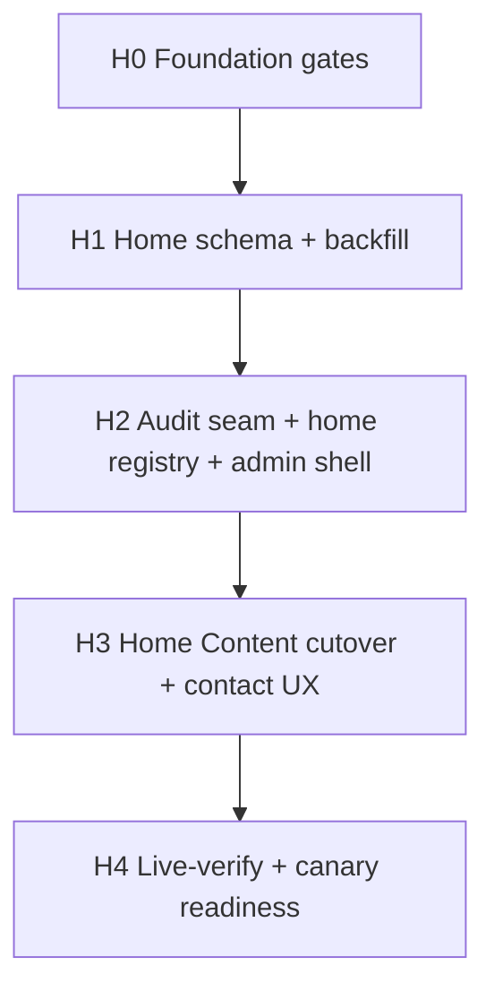

# Home CMS slice — small implementation sprints

Date: 2026-08-27  
Wayfinder ticket: [Task: draft small-sprint plan for Home CMS slice](https://github.com/aiiiinerv-ctrl/kkd_prop_web/issues/58)  
Map: [Map: Home CMS slice — hero, contact, Our service, FAQ](https://github.com/aiiiinerv-ctrl/kkd_prop_web/issues/52)

## Status

**Plan only — do not implement until:**

1. Owner sign-off ([#60](https://github.com/aiiiinerv-ctrl/kkd_prop_web/issues/60)) after live-verify matrix ([#59](https://github.com/aiiiinerv-ctrl/kkd_prop_web/issues/59))
2. Foundation gates green ([#57](https://github.com/aiiiinerv-ctrl/kkd_prop_web/issues/57) / [#51](https://github.com/aiiiinerv-ctrl/kkd_prop_web/issues/51) → Gate D/E)

This document does **not** change schema, code, or production. It is the required sprint breakdown for map #52 before execution tickets open.

## Destination (locked)

Admin can edit on Home:

- Hero copy + hero image  
- Contact values (phone / LINE / Facebook) via **SiteSettings** (same row as Settings)  
- Our service (Services CTA) copy  
- FAQ chrome + FAQ CRUD (TH+EN, sort, max **12** planning default — see open decision)

Icons stay template-owned. **Out:** Latest Works / featured portfolio, Home SEO/Properties, Shared CTA banner migration, other five pages.

## Research pack (inputs)

| Asset | Ticket |
| --- | --- |
| [`home-cms-slice-inventory-research.md`](home-cms-slice-inventory-research.md) | #53 |
| [`home-cms-slice-edge-cases-research.md`](home-cms-slice-edge-cases-research.md) | #54 |
| [`home-cms-slice-impact-research.md`](home-cms-slice-impact-research.md) | #55 |
| [`home-cms-slice-security-research.md`](home-cms-slice-security-research.md) | #56 |

Mother plan (do not fork architecture): [`pages-cms-implementation-sprints.md`](pages-cms-implementation-sprints.md) Sprint 1–5.  
Ownership / data-model / security: `pages-cms-content-ownership-decisions.md`, `pages-cms-data-model-migration-decision.md`, `pages-cms-properties-security-guardrails.md` (upload/concurrency patterns only).

## Open decision for owner (#60)

| Topic | Charting (#52) | Approved data-model | Plan / #60 |
| --- | --- | --- | --- |
| FAQ max when visible | 20 | 1–12 | **12 — locked (owner รับทั้งชุด, 2026-08-27)** |
| `HomeFeaturedPortfolioProject` in H1 | fog | mother Sprint 3 includes it | **Defer entirely** (owner Q2 = A, 2026-08-27) |
| Admin nav (Home-only) | fog | six-page tree in mother plan | **Pages parent + Home child only**; About stays `/admin/content/about` (owner Q3 = A) |
| Production canary | fog | named canary in mother plan | **No automatic canary** — owner names each canary after H4 (owner Q4 = A) |

## Sign-off

Owner closed [#60](https://github.com/aiiiinerv-ctrl/kkd_prop_web/issues/60) on 2026-08-27. Execution may proceed per H0–H4; production Home writes still require Gate E (#51 → D/E).

## Non-negotiables (from map + research)

- No Home write on MyISAM; InnoDB + FK + backup/restore including `public/pages/` first.  
- TH+EN complete on every required field; whole-record message fallback only if row absent.  
- One aggregate audited save for Home parent + FAQ children + hero key; optimistic `version`.  
- Contact RBAC = Settings (`ADMIN`\|`MARKETING`); http(s) URLs only; no Home-only contact copy.  
- CTA destinations = typed internal presets; plain-text FAQ/copy; no mass-assign.  
- Hero: generate key under `public/pages/home/hero/`; compensate-delete on conflict; static fallback if blob missing.  
- Live-verify: local `build`+`start`, web-view TH+EN, sanitized evidence; production read-only until named canary.  
- Before each coding sprint: short **before-fix summary**. After: **after-fix summary**. Stop on first failed gate.

## Before-fix summary (whole slice)

What must change to meet Destination (planning inventory — refine per sprint):

| Layer | Change |
| --- | --- |
| DB | Additive `HomePageContent` + `HomeFaqItem` (+ `version`); backfill from `messages.home` / `messages.faq`; copy hero into managed storage |
| Audit | Aggregate mutation seam in `src/lib/audit.ts` |
| Registry | Trusted `home` entry (admin/public paths, consumers, rollout `legacy`→`pages`) |
| Actions | Home aggregate action + shared contact helper (Settings path) |
| Admin | `/admin/pages/home` Content UI + Pages nav stub; site-wide contact warning |
| Public | `home-content.tsx` + `FaqSection` read DB views; dynamic FAQ list |
| Storage/backup | `public/pages/` in backup/restore |
| Tests | e2e Home Content + RBAC; keep existing Home SEO Settings tests |
| Docs | Dual-SoT PLAN / INDEX when execution issues open |

**Explicitly not changing in this slice:** Latest Works query, PageSeo ownership, Shared CTA source, About/Services/Packages/Portfolio/Calculator pages, feature/contact icon glyphs.

## Dependency map (slice sprints)

Mapping to mother plan: H0 ≈ Sprint 1–2; H1 ≈ trimmed Sprint 3; H2 ≈ trimmed Sprint 4; H3 ≈ trimmed Sprint 5; H4 ≈ verify subset of Sprint 11 patterns.

---

## Sprint H0 — Foundation gates

**Outcome:** production DB and backup path safe for aggregate Home writes.  
**Owner:** human + `hosting-deploy-specialist` / ops as needed.  
**Tracks:** [#57](https://github.com/aiiiinerv-ctrl/kkd_prop_web/issues/57), [#51](https://github.com/aiiiinerv-ctrl/kkd_prop_web/issues/51).  
**Agent:** none for DDL until owner schedules windows.

### DoD

- [ ] Gate B/C maintenance + off-host backup evidence  
- [ ] Gate D InnoDB + intended FKs  
- [ ] Gate E verification; writes reopened only when green  
- [ ] Backup/restore plan includes future `public/pages/` (or block H3 hero upload until included)

### Rollback

Stop; no CMS DDL. Keep old app.

### Live-verify

Ops evidence only (runbooks), not Home CMS UI.

---

## Sprint H1 — Additive Home schema + backfill

**Outcome:** `HomePageContent` + `HomeFaqItem` exist and match current public digests; old app still sole reader/writer.  
**Depends on:** H0.  
**Agent:** `nextjs-dev` (after owner DDL checkpoint).

### Scope

- Prisma models + additive SQL (hand-applicable / idempotent per host constraints in mother Sprint 3).  
- Backfill TH/EN from `home` + `faq` messages (5 FAQ rows).  
- Copy/re-encode static hero into managed key; store key on row.  
- **Defer:** `HomeFeaturedPortfolioProject` (owner-locked), other page singletons, PageSeo extensions, SiteSettings CTA columns — list in after-summary as deferred mother Sprint 3 items.

### DoD

- [ ] Tables InnoDB with FK parent→FAQ; unique sortOrder  
- [ ] Backfill twice → identical digests; 5 FAQs  
- [ ] Hero blob retrievable via `/files/...`  
- [ ] Public site unchanged (no reader cutover yet)

### Before / after ritual

- **Before:** schema diff, backfill sources, storage key namespace.  
- **After:** row counts, digests, deferred objects list.

### Rollback

Redeploy prior build; additive tables unused. No down-migration required.

---

## Sprint H2 — Aggregate audit seam + home registry + admin shell

**Outcome:** one maintainable write path and `/admin/pages/home` shell; registry `home` still `legacy` (no public cutover).  
**Depends on:** H1.  
**Agent:** `nextjs-dev`; then `audit-compliance-reviewer` on new actions (even if draft-gated).

### Scope

- Extend `src/lib/audit.ts` for versioned aggregate save (parent + FAQ children).  
- Minimal page registry with `home` only (or six keys with only `home` enabled).  
- Admin route `/admin/pages/home` Content form (may save to DB behind feature flag / registry `legacy` still reading messages — prefer **admin writes allowed only when registry allows**, or admin-only preview until H3).  
  **Preferred:** admin can save aggregates while public still reads messages until H3 flips registry — document dual-read carefully; safer is **no public cutover until H3** and admin saves land in DB for staging verify only.  
- Sidebar: Pages → หน้าแรก only (About remains at `/admin/content/about` until its own sprint).  
- Contact fields on Home UI wired to **shared** Settings mutate helper; roles enforced server-side.

### DoD

- [ ] Stale version → conflict, zero side effects  
- [ ] FAQ 0 visible / >12 / incomplete TH-EN rejected  
- [ ] EDITOR cannot mutate contact; can mutate content (per matrix)  
- [ ] Audit one row per Home save; no secrets/paths/bytes  
- [ ] Unknown FormData keys rejected  

### Rollback

Disable admin route / redeploy; DB rows retained.

### Live-verify (admin only)

Local production-mode: open `/admin/pages/home`, conflict + validation cases (matrix #59).

---

## Sprint H3 — Public Home Content cutover + contact UX

**Outcome:** `/th` and `/en` read complete Home Page Content; FAQ dynamic; hero from managed key with static fallback; contact editable from Home with site-wide warning.  
**Depends on:** H2.  
**Agent:** `nextjs-dev`; `i18n-parity-checker`; `audit-compliance-reviewer`.

### Scope

- Update `home-content.tsx`, `FaqSection`, content views.  
- Registry `home` → `pages` for Content (SEO remains Settings).  
- Revalidate `/th`,`/en`,`/admin/pages/home` on Content save; contact uses existing SiteSettings consumer list.  
- Extend e2e admin CRUD + RBAC for Home Content; **keep** Settings Home SEO tests.  
- Latest Works unchanged.

### DoD

- [ ] Missing Home row → whole-record messages fallback  
- [ ] With row present, message edits do not affect public  
- [ ] FAQ add/edit/reorder/delete within max; empty+hidden OK; visible+empty rejected  
- [ ] Hero missing blob → static fallback + admin warning  
- [ ] Contact from Home = Settings values; http(s) only  
- [ ] TH and EN web-view match saved content  

### Before / after ritual

- **Before:** frozen Home digest, FAQ IDs/order, hero key, contact snapshot.  
- **After:** fields changed, audit/version, cache proof, screenshot manifest.

### Rollback

Registry → `legacy` / prior build; messages + static hero return; preserve DB rows.

### Owner checkpoint

Approve production cutover; canary save only if separately named.

---

## Sprint H4 — Live-verify pack + canary readiness

**Outcome:** matrix from #59 fully executed locally; production smoke read-only; ready for owner canary decision.  
**Depends on:** H3.  
**Agent:** `nextjs-dev` (+ verify skill).

### DoD

- [ ] All High/Blocker rows from edge + security research exercised or waived in writing  
- [ ] Sanitized TH/EN screenshots (3 viewports if practical) under `docs/plans/assets/` (no auth secrets)  
- [ ] `npm run build` + listed e2e green  
- [ ] Production smoke read-only (no canary unless approved)

### Rollback

N/A (verification sprint).

---

## Live-verify checklist (seed for #59)

Minimum web-view cases (local `build`+`start`):

1. Hero text TH/EN after save  
2. Hero image replace + missing-blob fallback  
3. Quick-contact icons use Settings values; invalid URL rejected  
4. Our service copy + internal link preset  
5. FAQ: 1 item, 12 items, reject 13; hide section when visibility false  
6. Conflict: two tabs stale version  
7. RBAC: EDITOR content OK / contact denied; FINANCE denied Home page  
8. ISR: public updates without waiting full 300s after save (explicit revalidate)

Full matrix → ticket #59 asset.

## Agents at execution time

| Sprint | Primary | Independent |
| --- | --- | --- |
| H0 | Human / hosting | — |
| H1–H3 | `nextjs-dev` | `audit-compliance-reviewer` (mutations); `i18n-parity-checker` (H3) |
| H4 | `nextjs-dev` | optional design-business only if UX contested |

## Out of scope (do not pull into H1–H4)

- Latest Works / Featured Portfolio  
- Home Properties / SEO move / OG  
- Shared CTA SiteSettings migration  
- About + five other page cutovers  
- Editable icons  
- Issue #36 notifications  
- Repo hygiene  

## Definition of map #52 “way clear”

After #59 matrix exists and #60 owner sign-off records FAQ max + this plan accepted, open **execution** GitHub issues / dual-SoT PLANs per H0–H4 (or claim existing #51/#57 for H0). Map #52 may then close or convert Notes to carry execution — owner choice at #60.

## Sources

Map #52 Notes; research #53–#56; mother `pages-cms-implementation-sprints.md` Sprint 1–5.  
