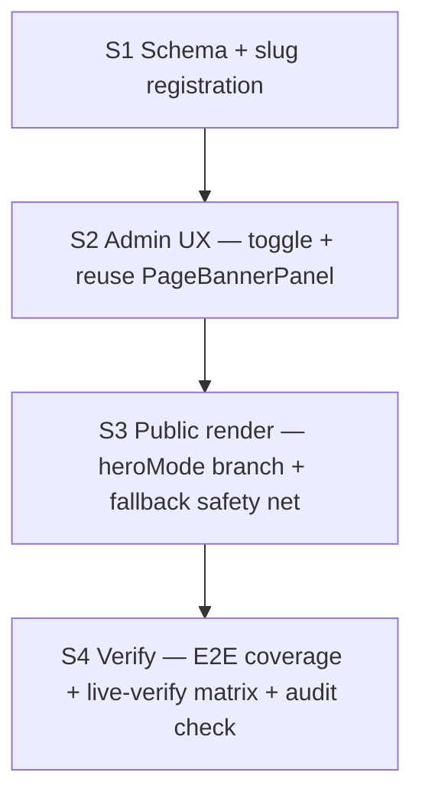

# Home hero toggle — small implementation sprints

Date: 2026-09-07
Wayfinder ticket: [Task: draft small-sprint plan for Home hero toggle](https://github.com/aiiiinerv-ctrl/kkd_prop_web/issues/136)
Map: [Map: Home hero — เลือกได้ระหว่าง hero banner เดิม กับ slide image แบบหน้าอื่น](https://github.com/aiiiinerv-ctrl/kkd_prop_web/issues/132)

## Status

**Plan only — do not implement until [#137 owner sign-off](https://github.com/aiiiinerv-ctrl/kkd_prop_web/issues/137) closes.** This document does not change schema, code, or production.

## Destination (locked)

Admin can switch Home's hero between:
- **Hero (classic)** — existing split layout (image + kicker/title/subtitle/CTA/proof/feature icons), unchanged
- **Banner (slide)** — reuses the existing `PageBanner`/`PageBannerSlide` system (FIXED 1 image or SLIDES 2–5), **replaces the whole hero section**, no text overlay

Out of scope: changes to the 7 existing banner pages, new hero modes (video/animated), Latest Works/SEO/Properties (per map #52).

## Research pack (inputs)

| Asset | Ticket | Key findings |
| --- | --- | --- |
| [`home-hero-toggle-impact-research.md`](home-hero-toggle-impact-research.md) | [#134](https://github.com/aiiiinerv-ctrl/kkd_prop_web/issues/134) | No SEO/LCP impact; `bannerRevalidatePaths()` bug for `"home"`; no E2E banner coverage |
| [`home-hero-toggle-edge-cases-research.md`](home-hero-toggle-edge-cases-research.md) | [#135](https://github.com/aiiiinerv-ctrl/kkd_prop_web/issues/135) | Must fall back to Hero when Banner mode has no active slides (blank-homepage fail-safe); reject `mode: "OFF"` server-side for `pageSlug: "home"` |
| [Grilling: UX resolution](https://github.com/aiiiinerv-ctrl/kkd_prop_web/issues/133) | #133 | 2-tier toggle (Hero/Banner → Fixed/Slides) at top of Home form; reuse `PageBannerPanel`; hide-not-delete classic hero fields |

## Non-negotiables (from map + research)

- Public render must **never go blank** — Banner mode with no active slides falls back to classic Hero.
- `heroMode` defaults to `HERO` (`@default(HERO)`) so existing production data is unaffected by the migration itself.
- Classic hero fields (`heroImageKey`, kicker/title/subtitle/CTA/proof/feature labels) are preserved in the DB when switching to Banner mode — never deleted, only hidden in the admin form.
- `pageBannerFormSchema` must reject `mode: "OFF"` when `pageSlug === "home"` (defense-in-depth alongside the UI restriction).
- `bannerRevalidatePaths()` must special-case `"home"` → locale root, same pattern as the existing `"about"` special-case.
- Every mutation stays behind `requireRole("ADMIN","SALES","MARKETING","EDITOR")` + audited (`homeContentAggregate` for `heroMode`, existing `PageBanner` audit for slides) — no new RBAC surface.
- Before each sprint: short before-fix summary. After: after-fix summary. Stop on first failed gate.
- Live-verify per sprint before calling it done — see matrix below.

## Dependency map

---

## Sprint S1 — Schema + slug registration

**Outcome:** `heroMode` column exists (default `HERO`, no behavior change yet); `"home"` registered as a valid banner slug at the type/schema level; server rejects `OFF` for home.

**Agent:** `nextjs-dev`.

### Scope

- Add `heroMode` enum (`HERO | BANNER`) to `HomePageContent` in `prisma/schema.prisma`, `@default(HERO)`; `npx prisma migrate dev`.
- Add `heroMode` to `HOME_CONTENT_FIELDS`/validation in `src/lib/validations/home-content.ts` so it flows through the existing audited aggregate save.
- Add `"home"` to `BANNER_PAGE_SLUGS` in `src/lib/page-banners.ts`.
- Fix `bannerRevalidatePaths()`: special-case `"home"` → `["/th", "/en", "/admin/settings"]` (mirroring the `"about"` pattern).
- Add `superRefine` rule in `src/lib/validations/page-banner.ts` rejecting `mode === "OFF"` when `pageSlug === "home"`.

### DoD

- [ ] Migration applies cleanly; existing Home row reads `heroMode = HERO`
- [ ] `bannerPageLabel("home")` returns a sensible Thai label ("หน้าแรก")
- [ ] Submitting `mode: "OFF"` + `pageSlug: "home"` to `updatePageBanner` is rejected with a validation error
- [ ] Public site unchanged (no reader cutover yet — S1 is additive only)

### Rollback

Revert migration; no reader depends on the new column yet.

---

## Sprint S2 — Admin UX: toggle + reuse `PageBannerPanel`

**Outcome:** Admin can switch Home between Hero/Banner in the admin UI; data for both is preserved regardless of which is active.

**Depends on:** S1. **Agent:** `nextjs-dev`.

### Scope

- Add the 2-tier toggle (top of `home-client.tsx`, before existing hero fields): `รูปแบบ Hero` → `Hero แบบเดิม (มีข้อความ)` | `Banner แบบสไลด์ (เหมือนหน้าอื่น)`.
- When `Banner` selected, render `PageBannerPanel` with `pageSlug="home"` (its internal mode dropdown already offers only `FIXED`/`SLIDES` once `OFF` is stripped for home — confirm the client-side `MODE_OPTIONS` filtering matches the S1 server rule).
- Hide (don't unmount-and-lose-state) the classic hero fields when Banner is selected — keep them in the form's local state so switching back doesn't require a reload.
- `updateHomeContent` gains `heroMode` as an allowed/validated field (already covered by S1 schema work — this sprint wires the UI control to it).

### DoD

- [ ] Toggle persists across save + reload
- [ ] Switching Hero → Banner → Hero preserves both classic hero fields and any saved banner slides
- [ ] EDITOR/MARKETING/SALES/ADMIN can all use the toggle (same RBAC as existing Home content save)
- [ ] Admin UI never offers `OFF` for Home's banner mode

### Rollback

Feature-flag off by defaulting `heroMode` to `HERO` and hiding the toggle (single UI change) if a blocking issue surfaces post-deploy.

---

## Sprint S3 — Public render: `heroMode` branch + fallback safety net

**Outcome:** `home-content.tsx` renders classic Hero or `PageBanner` based on `heroMode`, with the fail-safe from edge-case research #135 wired in.

**Depends on:** S2. **Agent:** `nextjs-dev`.

### Scope

- In `HomeContent` (`src/app/[locale]/home-content.tsx`), branch on `homeRow.content.heroMode`:
  - `HERO` → existing split-layout render (unchanged).
  - `BANNER` → render `<PageBanner pageSlug="home" />` **only if** it actually resolves an active banner (see next point); otherwise fall back to the classic Hero render.
- Implement the fallback: `getPageBanner("home", locale)` already returns `null`/empty when no active slides exist — the Home render must check that result and use the classic Hero markup as fallback, not just `return null` (unlike the other 7 pages, Home cannot render nothing).
- Keep `resolveHomeHeroImage`/hero text fields fully computed regardless of mode, so the fallback path has everything it needs with no extra queries.

### DoD

- [ ] `heroMode = BANNER` + valid slides → banner renders, no text overlay, matches other pages' visual style
- [ ] `heroMode = BANNER` + zero active slides → classic Hero renders (never a blank gap) — this is the critical edge-case-research requirement
- [ ] `heroMode = HERO` → byte-for-byte same render as today (regression check)
- [ ] TH/EN both verified in both modes

### Rollback

Revert to always rendering classic Hero (ignore `heroMode`) — single conditional removal, no data loss since classic hero fields were never deleted.

---

## Sprint S4 — Verify: E2E coverage + live-verify matrix + audit check

**Outcome:** Automated + manual evidence that the toggle works end-to-end and doesn't regress the existing 7-page banner system or Home CMS.

**Depends on:** S3. **Agents:** `nextjs-dev` (E2E script), `audit-compliance-reviewer` (independent check), `i18n-parity-checker` if any new admin label needs TH/EN (admin UI is Thai-only, but banner slide alt/link text is public-facing and already TH/EN-gated by existing schema).

### Scope

- Extend `scripts/e2e-admin-crud.mts` with minimal coverage (closing the gap found in #134): switch Home to Banner mode, save 2 valid slides, verify public homepage shows the banner; switch back to Hero, verify classic hero returns.
- Run `.claude/skills/verify/SKILL.md` full protocol: local `build`+`start`, web-view TH+EN, both modes, both the fallback-empty-banner state and a populated-banner state.
- `audit-compliance-reviewer` pass over `updateHomeContent` (heroMode field) and `updatePageBanner` (pageSlug home) to confirm `requireRole`/`withAudit`/audited-aggregate coverage and no secret leakage.

### DoD

- [ ] New E2E scenario passes locally
- [ ] Live-verify matrix (below) fully checked, evidence saved under `docs/plans/assets/home-hero-toggle-result/`
- [ ] `audit-compliance-reviewer` reports no findings (or findings resolved)
- [ ] No regression in existing `e2e-admin-crud.mts` / `e2e-booking.mts` runs

### Rollback

None needed — S4 is verification only; a failed gate blocks sign-off, not a revert.

---

## Live-verify web-view matrix (S3–S4)

Legend: **P** = must pass, **B** = blocker (from edge-case research).

| ID | Check | Sev | How | Pass criteria |
| --- | --- | --- | --- | --- |
| V1 | Toggle switches admin form between Hero/Banner sections | P | M | Correct fields show/hide; no console errors |
| V2 | Save Hero mode (no banner touched) | P | M/A | Public homepage unchanged from current baseline |
| V3 | Save Banner mode with 2 slides (SLIDES) | P | M | Public homepage shows carousel, no text overlay, autoplay + arrows work |
| V4 | Save Banner mode with 1 slide (FIXED) | P | M | Public homepage shows single banner image |
| V5 | **Banner mode, zero active slides** | B | M | Public homepage falls back to classic Hero — **never blank** |
| V6 | Switch Banner → Hero → Banner | P | M | Classic hero fields and banner slides both intact after round-trip |
| V7 | TH + EN both checked for V2–V5 | P | M | Locale-correct copy/alt text in both |
| V8 | Mobile (390×844) for V3/V4 | P | M | Slim banner strip renders correctly, no layout break |
| V9 | Non-admin role denied toggle mutation | B | A | Existing RBAC test still passes |
| V10 | Stale `version` conflict on either form | B | M/A | Conflict toast; no partial write |
| V11 | Audit log shows `heroMode` change + banner slide change as separate entries | P | M | Both visible in `/admin/audit` with correct before/after |
| V12 | `updatePageBanner` rejects `mode: "OFF"` for `pageSlug: "home"` | B | A | Server validation error, not silently accepted |

Evidence layout: `docs/plans/assets/home-hero-toggle-result/<sprint-id>/` — manifest, screenshots (desktop/mobile, TH/EN, both modes), automated check output. Same discipline as `home-cms-slice-live-verification-matrix.md` (no `.env`, cookies, absolute storage paths).

---

## After-fix summary (fill in post-execution, per `.claude/skills/verify/SKILL.md`)

_To be completed when execution tickets close — not part of this planning ticket._
