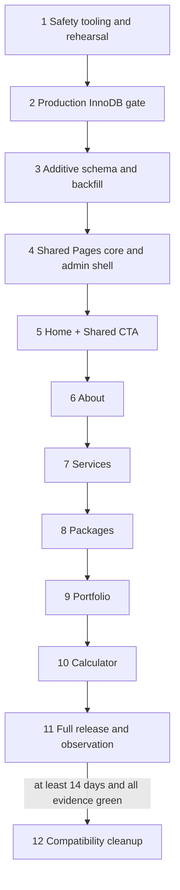

# Pages CMS implementation sprints

Date: 2026-08-25  
Wayfinder ticket: [Slice the approved CMS redesign into small implementation sprints](https://github.com/aiiiinerv-ctrl/kkd_prop_web/issues/50)

## Status and purpose

This is the implementation handoff for reorganizing the admin CMS under a
Pages root for Home, About, Services, Packages, Portfolio, and Calculator. It
orders the approved ownership, interaction, security, data, migration, cache,
and verification decisions into small reviewable sprints.

Implementation has **not** started. This document does not change source code,
Prisma schema, data, storage, dependencies, production configuration, or the
deployed site. It is the required committed plan that must exist before those
changes begin.

The existing before-state is frozen in
[`pages-cms-current-state-inventory.md`](pages-cms-current-state-inventory.md)
and `docs/plans/assets/pages-cms-baseline/`. Do not regenerate or replace those
screenshots after implementation begins.

## Before implementation: what must change

1. **Database safety** — prove backup/restore, convert every production table
   from MyISAM to InnoDB, restore the eleven intended Foreign Keys, and make
   engine/constraint checks permanent release gates.
2. **Data model** — extend `PageSeo`, add five typed Page Content singletons,
   extend `AboutContent` and `SiteSettings`, add Home FAQ and concrete Featured
   Reference rows, and backfill complete TH/EN records additively.
3. **Trusted page seam** — create one code-owned six-page registry for keys,
   labels, routes, models, cache consumers, rollout state, and legacy redirects.
4. **Mutation seam** — deepen `src/lib/audit.ts` so one optimistic aggregate
   save, its children/references, and one bounded Audit Log snapshot commit in
   the same InnoDB transaction.
5. **Security** — freshly re-check active database role for Properties, apply
   strict typed validation, reject raw metadata/unknown keys, classify high-risk
   SEO transitions server-side, and harden image lifecycle and cleanup.
6. **Admin experience** — add the Pages sidebar tree and six canonical routes,
   Content/Properties tabs, TH/EN editing, preview, warnings, conflict recovery,
   responsive navigation, and temporary 307 compatibility redirects.
7. **Public ownership** — move each fixed-template page from message/legacy
   sources to complete Page Content records one page at a time, preserving
   whole-record fallbacks and reusable Content Items.
8. **Metadata and caching** — render structured title/description/OG/canonical/
   robots values, align sitemap membership, and revalidate the exact TH/EN,
   reverse-reference, detail-route, and admin consumers.
9. **Recovery and evidence** — include bounded CMS-public image namespaces in
   backup/restore, run isolated production-mode verification, capture sanitized
   three-viewport browser evidence, and perform deployed-site smoke read-only by
   default.

## Non-negotiable release rules

- TH and EN move together in every schema, action, fixture, public read, and
  visual check. A one-language save is invalid.
- Admin mutations authorize server-side and use the single audited-mutation
  seam. Proxy checks, hidden tabs, and client acknowledgements are not security
  boundaries.
- Page Properties accept exactly six trusted page keys; legacy Settings owns
  Booking, Contact, Testimonials, and Cookie Policy after final cutover.
- During staged cutover, the registry partitions target keys into exactly one
  active writer: legacy Settings while a page is `legacy`, Pages Properties
  after it is `pages`. No key may be writable from both or neither.
- No raw metadata HTML, arbitrary external canonical, arbitrary CTA URL,
  client-selected storage deletion key, or editable Calculator formula enters
  the design.
- `TabsContent keepMounted` and tabbed-form `noValidate` remain intentional.
- No Pages CMS write is enabled until production InnoDB, Foreign Keys, backup,
  restore, and forced-rollback evidence are green.
- Production browser checks are read-only unless the owner separately approves
  a named canary save. Authenticated production screenshots never enter the
  repository.
- Production DDL, maintenance mode, backfill, deployment, canary writes, and
  compatibility cleanup each require their own owner checkpoint.
- Every sprint stops on its first failed gate. “May be cached,” “build passed,”
  or “looks fine in dev” is not acceptance evidence.

## Dependency map

The page order is deliberate. Home exercises the deepest aggregate—managed
image, FAQ children, Featured References, shared CTA, preview, and Properties—
so architectural weaknesses surface before five pages copy the pattern. The
following pages then add one distinct domain concern at a time.

### Why this is the smallest safe split

- Safety-tool implementation and live engine conversion cannot share a sprint:
  rehearsal evidence must exist before production authorization is requested.
- Engine conversion and Pages DDL cannot share a rollback boundary: the old
  application must prove healthy on InnoDB before unused CMS schema is added.
- Additive data and application ownership cannot share a cutover: backfill and
  old-build compatibility must be verified while old readers still own output.
- The common module/shell must be proven disconnected before the first page
  reuses it, or a shared flaw would reach all six pages simultaneously.
- Each page has a distinct source, form, cache graph, failure surface, and
  rollback switch. Combining pages would prevent page-local rollback and violate
  the approved page-by-page cutover.
- Compatibility cleanup is time- and evidence-gated, so it cannot be bundled
  with release merely to reduce sprint count.

Splitting any item further would separate code that must commit atomically
(Content + Properties ownership for one page); combining adjacent items would
merge different production authorization or rollback points.

## Sprint operating protocol

Every sprint is one reviewable change set and uses this sequence:

1. Write the **before summary** into that sprint's result manifest: intended
   files/surfaces, invariants at risk, isolated fixtures, exact commands,
   screenshots, rollback point, owner approvals, and excluded work.
2. Add or update a red-capable focused check before behavior-changing code when
   a correct seam exists.
3. Implement only the named scope. Keep schema, feature, fix, test, and docs
   commits separated by Conventional Commit type.
4. Run the sprint checks against dedicated test DB/storage and a clean
   `next build` + `next start` when `src/`, Prisma, or messages are affected.
5. Capture evidence under
   `docs/plans/assets/pages-cms-result/<sprint>/`; never overwrite baseline.
6. Write the **after summary**: actual files, schema/data/storage effects,
   security and maintainability decisions, exact observed results, screenshot
   manifest, deviations, residual risks, and executable rollback.
7. Obtain the named owner checkpoint before any live-mutating next step.

Suggested commit boundaries within a sprint are `test(...)`, `feat(...)` or
`fix(...)`, then `docs(...)`; never combine two Conventional Commit types in
one commit.

## Sprint 1 — Engine safety tooling and production-shaped rehearsal

**Outcome:** make the InnoDB conversion and recovery path agent-runnable and
red-capable without touching production.

**Depends on:** committed plan only.

### Scope and files/surfaces

- Add `scripts/verify-storage-engine.mts` for engine support/default, exact
  application-table inventory, eleven stable Foreign Keys, orphan counts,
  indexes, row counts, and transaction fault injection.
- Extend `scripts/backup-db.mts`, `scripts/restore-db.mts`, and
  `scripts/lib/backup-format.mts` to capture/verify schema metadata and make
  their transactional-engine prerequisite explicit.
- Add a test-only MyISAM → InnoDB rehearsal harness against a disposable,
  production-shaped database and temporary storage root.
- Add `docs/plans/pages-cms-innodb-conversion-runbook.md`; correct the MyISAM/
  1000-byte attribution in `docs/adr/0006-mysql-via-mariadb-adapter.md` and
  `docs/plans/kkd-shared-hosting-redeploy-runbook.md`.
- Define the host-level bilingual maintenance/read-only procedure. Do not add a
  broad application feature flag unless rehearsal proves the hosting layer
  cannot fully quiesce writes.

### Migration and compatibility

No production mutation. Restore a sanitized/current-shape fixture into a new
test database, convert copied tables, add constraints, and deliberately fail an
Audit Log insert and a restore statement.

### Security and maintainability

- Refuse normal DB names, normal `STORAGE_ROOT`, missing backup destination, or
  unrecognized table names; SQL identifiers come from a checked constant list.
- Output counts, engines, constraint names, and hashes only—no customer rows,
  snapshots, secrets, URLs with credentials, or storage paths.
- Keep operational SQL in one versioned runbook and verifier rather than ad hoc
  phpMyAdmin snippets.

### Acceptance and live evidence

- MyISAM fault fixture stays red; converted clone stays green with entity and
  Audit Log both rolled back.
- Restore fault leaves the pre-restore InnoDB clone intact.
- All current tables/data types/indexes convert; eleven orphan checks are zero
  in the fixture; running verifiers twice is deterministic.
- A rehearsed maintenance page/state is readable in TH and EN on desktop and
  mobile and cannot falsely confirm a Lead submission or admin save.
- Evidence: `s01-engine-readiness/` manifest, sanitized output, and maintenance
  screenshots. Existing public/admin baseline remains unchanged.

### Rollback and checkpoints

- **Rollback:** revert scripts/docs; delete only validated disposable DB and
  storage targets. Production is unchanged.
- **Before summary:** list temporary targets, fault injections, host assumptions,
  and exact cleanup guard.
- **After summary:** record conversion duration/space, fault outputs, restored
  counts/hashes, maintenance behavior, and unresolved host unknowns.
- **Owner checkpoint:** approve read-only production inventory for Sprint 2;
  this does not authorize DDL.

## Sprint 2 — Production InnoDB and Foreign Key release gate

**Outcome:** make the existing production database satisfy the atomic audit,
referential integrity, and recovery invariants before Pages DDL exists.

**Depends on:** Sprint 1 rehearsal fully green.

### Scope and files/surfaces

- Execute the approved conversion runbook through the production panel.
- Produce sanitized evidence and an execution record; no Pages feature source
  is changed in this sprint.
- Run existing verification suites against an isolated clone using the exact
  unchanged production build; deployed production receives read-only smoke.

### Migration and compatibility

1. Read-only inventory: server version, `SHOW ENGINES`, default engine, quota,
   exact live schema, table sizes, indexes, current constraints, and orphans.
2. Owner approves maintenance and conversion separately.
3. Quiesce all public/admin writes; drain requests.
4. Create and download an off-host DB/private-storage/schema snapshot and prove
   its isolated restore.
5. Convert one recorded table at a time to explicit InnoDB; keep writes blocked
   while engines are mixed.
6. Add the eleven named Foreign Keys only after zero-orphan checks.
7. Verify engines, constraints, rows, indexes, hashes, audit readability, and
   recovery; then reopen writes.

### Security and maintainability

- Never use `FOREIGN_KEY_CHECKS=0` to hide invalid production data.
- Never silently delete, null, or remap an orphan; stop and request an explicit
  data-remediation decision.
- Do not convert back to MyISAM as routine rollback. Already converted tables
  are valid; keep maintenance on and resume/fix from the recorded point.
- No production record, credential, cookie, private slip, or authenticated
  screenshot is copied into evidence.

### Acceptance and live evidence

- Every live application table reports InnoDB and all intended Foreign Keys
  exist; transaction and restore proofs pass on the production-shaped clone.
- Existing `scripts/verify-all.mts`, audit verification, calculator verification,
  backup/restore drill, and the exact production build remain green on the
  isolated verification environment.
- Deployed read-only smoke: all current TH/EN public routes 200, login guard and
  private-file 401 unchanged, current admin pages readable with owner-controlled
  session.
- Evidence: `s02-production-innodb/`; public screenshots may be committed,
  authenticated screenshots stay outside the repository.

### Rollback and checkpoints

- **Rollback:** before DDL, abort with no change. During conversion, keep
  maintenance and repair/resume; on failed data verification restore into a
  clean schema/database from the rehearsed snapshot.
- **Before summary:** exact tables/order, constraints, row counts/hashes,
  maintenance window, off-host backup location confirmation, and go/no-go.
- **After summary:** per-table duration/result, constraint inventory, checks,
  smoke statuses, write-reopen time, and any anomaly.
- **Owner checkpoints:** separate approval for maintenance, backup, each live
  DDL batch, reopening writes, and any canary. No approval is inferred.

## Sprint 3 — Additive Pages schema, recovery coverage, and idempotent backfill

**Outcome:** install and populate the typed hybrid data model while the old
application remains the only reader/writer.

**Depends on:** production InnoDB gate complete.

**Status (2026-08-27):** Gate B–E **GREEN**. Dual-SoT execution:
[#66](https://github.com/aiiiinerv-ctrl/kkd_prop_web/issues/66) /
`backlogs/ISSUE_066_pages_cms_sprint3_additive/PLAN.md` (`needs-info` until
owner schedules DDL / backfill / cleanup). **Home carve-out:** `HomePageContent`
+ `HomeFaqItem` (+ managed hero / FAQ backfill) already shipped in Home pilot
#61 — do not recreate; remaining models only. `HomeFeaturedPortfolioProject`
still owner-deferred (#60) unless #66 decides otherwise.

**Prep:** [`pages-cms-sprint3-prep.md`](pages-cms-sprint3-prep.md)
— checklist before the first migration PR.

### Scope and files/surfaces

- `prisma/schema.prisma`, a new additive migration with explicit
  `ENGINE=InnoDB`, and regenerated `src/generated/prisma/`.
- Extend `PageSeo`; add `HomePageContent`, `HomeFaqItem`,
  `HomeFeaturedPortfolioProject`, `AboutFeaturedTestimonial`,
  `ServicesPageContent`, `PackagesPageContent`, `PortfolioPageContent`, and
  `CalculatorPageContent`; extend `AboutContent` and `SiteSettings` exactly as
  the data-model decision specifies.
- Update backup model order and bounded storage namespaces
  `public/seo/og/` and `public/pages/`.
- Add idempotent backfill and verification scripts plus the short-lived,
  secret-gated production backfill endpoint only if the host still cannot run
  the script directly.
- Add exact production-safe additive SQL because live production has no Prisma
  migration ledger.

### Migration and compatibility

- Add only columns, tables, indexes, defaults, and constraints; no rename,
  non-null tightening of legacy columns, or drop.
- Backfill PageSeo safe defaults/version, six complete TH/EN aggregates, five
  Home FAQs, frozen current Home projects/About testimonials, Shared CTA, and
  managed Home hero.
- Run backfill twice and compare normalized digests. Public pages, legacy admin,
  and Settings still use old sources.
- Remove the temporary endpoint and secret in a clean redeploy immediately
  after verified use.

### Security and maintainability

- Backfill accepts no arbitrary table/key/path/content; returns counts/digests
  only and never logs secret or customer content.
- New relationships use real named Foreign Keys; child/reference order and
  unique constraints match the approved model.
- Do not add generic Page/JSON/Media Asset models or duplicate Content Item
  fields.

### Acceptance and live evidence

- `npx prisma migrate dev`, generated client, and seed twice pass on isolated
  DB; production SQL applies twice to a restored clone with second run a no-op.
- Six aggregates are complete in both locales; reference IDs/order and FAQ
  digests match the frozen baseline; all new image keys are retrievable.
- Old build runs against expanded/backfilled clone and old public/admin
  screenshots remain visually/semantically unchanged.
- Backup → empty compatible schema/storage → restore reproduces every new table
  and bounded CMS image.
- Evidence: `s03-additive-data/` including schema inventory and baseline parity.

### Rollback and checkpoints

- **Rollback:** old build keeps serving and ignores additive data; leave new
  tables/columns/assets intact for investigation and retry. No down migration.
- **Before summary:** schema diff, exact backfill sources/digests, storage keys,
  endpoint gate, old-build command, and recovery target.
- **After summary:** applied objects, row/reference counts, idempotence, image
  digests, old-build result, endpoint removal, and residual data warnings.
- **Owner checkpoints:** additive production DDL, gated backfill, and cleanup
  redeploy each require separate approval.

## Sprint 4 — Shared Pages module, audited aggregate seam, and admin shell

**Outcome:** establish one maintainable implementation path for all pages while
keeping every production page in legacy ownership.

**Depends on:** Sprint 3 data/recovery evidence.

### Scope and files/surfaces

- Add a deep `src/lib/pages/` module with one public entry point owning the six
  trusted keys, Thai labels, admin/public paths, model/read mapping, cache
  consumers, allowed Content roles, Properties roles, and rollout state.
- Extend `src/lib/audit.ts` with a bounded aggregate transaction seam; keep
  existing `auditedEntity()` consumers stable.
- Add `src/lib/validations/page-content/` and `page-properties.ts` with strict
  paired text, canonical, robots, version, image-operation, child/order, and
  high-risk rules.
- Add server-only page readers/view-models and actions under `src/actions/pages/`;
  no arbitrary row IDs, routes, cache paths, or deletion keys cross the seam.
- Add shared admin components under `src/components/admin/pages/`: shell, tabs,
  bilingual fields, status/warning panels, unsaved guard, conflict recovery,
  preview drawer/mode, and responsive selector.
- Add canonical dynamic route
  `src/app/admin/(dashboard)/pages/[page]/page.tsx`, while keeping the Pages
  sidebar root hidden until the first page cutover.
- Add focused scripts named in the live-verification matrix and the maintained
  Playwright-compatible axe dependency.

### Migration and compatibility

No new DDL/data. All six rollout states remain `legacy`; canonical routes fail
closed/not-found rather than exposing dormant Properties or Content.

### Security and maintainability

- Properties reads/actions freshly re-read active role from DB; Content uses
  the approved existing role contract; excluded roles receive no data.
- Registry state creates a disjoint writer partition during rollout.
- Shared forms preserve `TabsContent keepMounted`, keyboard/focus semantics,
  object-URL cleanup, and server-authoritative validation.
- Aggregate snapshots are bounded and never contain secrets, image bytes,
  absolute paths, or copied Content Item records.

### Acceptance and live evidence

- Pure model checks cover exact keys, routes, rollout partition, locale
  completeness, canonical normalization, high-risk classification, aggregate
  ordering/limits, and cache graph.
- Forced audit failure and stale version cause zero aggregate/child/audit/blob/
  cache side effects.
- All roles and direct page/action key abuse fail as specified while legacy
  routes still work.
- Shared shell passes keyboard/axe checks at desktop, tablet, and mobile using
  synthetic fixtures; nothing new is reachable on deployed production.
- Evidence: `s04-pages-core/`; no public result baseline changes expected.

### Rollback and checkpoints

- **Rollback:** revert disconnected core/shell commits; schema/backfill remains
  harmless and old ownership unchanged.
- **Before summary:** module interface, rollout-state table, auth matrix, action
  return unions, fixtures, axe rules, and no-exposure assertion.
- **After summary:** actual public API, audit-seam compatibility, denial matrix,
  conflict/fault results, shell screenshots, dependency additions, and cleanup.

## Sprint 5 — Home Content, Shared CTA, and Home Properties tracer

**Outcome:** cut Home over end-to-end and prove the deepest pattern before it is
reused elsewhere.

**Depends on:** Sprint 4.

### Scope and files/surfaces

- Enable `home` in the registry and expose Pages → หน้าแรก.
- Add Home Content/Properties forms and shared Properties form/OG preview.
- Update `src/app/[locale]/page.tsx`, `home-content.tsx`, Home site components,
  `src/components/site/cta-banner.tsx`, `src/lib/content/`, and `src/lib/seo.ts`
  to consume complete Home/Shared CTA views.
- Add Home hero immutable upload lifecycle, FAQ aggregate, up-to-four Portfolio
  Featured References, typed CTA presets, section visibility, and exact cache
  reverse dependencies.
- Move Home PageSeo write ownership out of Settings in the same release; keep
  nine legacy PageSeo entries there during staged rollout.

### Migration and compatibility

No DDL. Use the verified backfill row. Missing Home row uses the entire
same-locale message record/static hero; malformed row fails visibly without
per-field mixing. Home has no old admin route redirect.

### Security and maintainability

- Validate 1–12 visible FAQ rows, maximum four project references, stable IDs,
  normalized order, typed CTA destinations, and complete TH/EN.
- Block deletion of a referenced Portfolio Project with page name/admin link.
- Compensate-delete failed hero/OG uploads; delete old key only post-commit;
  missing blob falls back safely and warns admin.
- Properties are ADMIN/MARKETING only and use fresh role/version/high-risk rules.

### Acceptance and live evidence

- Home Content and Properties save each produce one version increment and one
  aggregate audit entry; both `/th` and `/en` update after pre-warming.
- FAQ 0/1/12/13, reference empty/unpublish/republish/delete-block, conflict,
  upload abuse/failure, canonical, robots/sitemap, and cache cases pass.
- Shared CTA update refreshes every current consumer while each page still
  controls visibility only.
- TH/EN desktop full-page results compare to baseline; admin Content,
  Properties, TH/EN preview, unsaved/conflict/high-risk, tablet/mobile, and OG
  fallback states are captured in `s05-home/`.

### Rollback and checkpoints

- **Rollback:** set Home registry state back to `legacy`/deploy prior build;
  Home returns to messages/static hero and Settings ownership. Preserve new
  row/assets for forward recovery.
- **Before summary:** frozen Home digest, image/reference IDs, every CTA
  consumer, exact pre-warm routes, test storage root, and Settings partition.
- **After summary:** fields/references/images changed, audit/version outputs,
  cache consumers, screenshot observations, rollback test, and warnings.
- **Owner checkpoint:** approve Home production cutover; any canary save is a
  separate approval. Without canary approval, deployed smoke remains read-only.

## Sprint 6 — About Content and About Properties

**Outcome:** move the existing singleton editor into the Pages pattern while
preserving its row and audit identity.

**Depends on:** accepted Home tracer.

### Scope and files/surfaces

- Enable `about`; add About Content/Properties forms and derived-stat labels,
  visibility controls, Shared CTA visibility, and up-to-three Testimonial
  Featured References.
- Update `src/actions/about-content.ts`, validation, About reader/view-model,
  `src/app/[locale]/about/page.tsx`, and audit label/diff presentation.
- Replace `/admin/content/about` with a route-level temporary 307 to
  `/admin/pages/about?tab=content`.
- Move About PageSeo ownership out of Settings; eight entries remain there:
  four uncut target pages plus the four fixed legacy pages.

### Migration and compatibility

No DDL. Preserve existing `AboutContent.id` and historical audit references.
The old build still reads compatible columns; missing complete record uses the
message-backed record.

### Security and maintainability

- Statistic values remain derived, icons/counts template-owned, and no dormant
  photo/unrendered controls are added.
- Testimonial deletion is blocked while referenced; unpublished rows warn/skip
  without losing order.
- Old route authenticates before final content exposure; Properties never leak
  through redirect/query to excluded roles.

### Acceptance and live evidence

- Existing and new About fields round-trip in TH/EN with one aggregate audit;
  reference lifecycle and reverse invalidation pass.
- Old route is 307, never 308; bookmarks reach Content after auth.
- About now has exactly one meaningful `<h1>` and retains intentional baseline
  layout/content after backfill.
- Capture TH/EN public, Content, Properties, reference warning, redirect, and
  responsive results in `s06-about/`.

### Rollback and checkpoints

- **Rollback:** disable About registry cutover and remove/reverse 307; old
  `/admin/content/about`, public reader, and Settings ownership resume.
- **Before summary:** original ID/digest, old route behavior, testimonial IDs,
  derived-stat source, consumers, and rollback build.
- **After summary:** ID/audit continuity, redirects, fields/references, head/
  cache results, screenshots, and rollback proof.

## Sprint 7 — Services Page Content, Content Items, and Properties

**Outcome:** unify page presentation and existing Service CRUD without copying
Service business records.

**Depends on:** Sprint 6.

### Scope and files/surfaces

- Enable `services`; add Page Content fields/group visibility and embed the
  existing Service Content Items area under the canonical Content tab.
- Adapt `src/actions/services.ts`, Services admin client/page, content readers,
  and `src/app/[locale]/services/page.tsx` to the registry/cache seam.
- Add temporary 307 from `/admin/services`; move Services PageSeo ownership
  from Settings.

### Migration and compatibility

No DDL and no Service row copy. Published Services remain ordered by
`sortOrder`; empty groups hide while their Page Content is retained.

### Security and maintainability

- Preserve ADMIN/SALES/MARKETING/EDITOR Content access and EDITOR publication/
  deletion restrictions.
- Do not expose stored Service images merely because fields exist.
- Service mutations refresh Services TH/EN and any registry-declared reverse
  consumers; no action accepts cache paths.

### Acceptance and live evidence

- Both kind groups, zero-item group, section visibility, item CRUD/publication,
  TH/EN completeness, audit, and cache pre-warm tests pass.
- Old route 307/auth behavior and exactly one Services `<h1>` pass.
- Capture TH/EN public, combined Content areas, Properties, empty-group, tablet,
  and mobile states in `s07-services/`.

### Rollback and checkpoints

- **Rollback:** disable Services registry cutover; old CRUD/public message copy
  and Settings ownership resume, with additive page row retained.
- **Before summary:** service IDs/order/publication, group digests, roles, route,
  all cache consumers, and excluded image behavior.
- **After summary:** presentation/item changes, permissions, redirects, audit/
  cache results, screenshots, and rollback verification.

## Sprint 8 — Packages Page Content, Content Items, and Properties

**Outcome:** unify Package presentation/CRUD while keeping commercial values and
derived production logic with Package records/code.

**Depends on:** Sprint 7.

### Scope and files/surfaces

- Enable `packages`; add page/empty/Seasonal/Payback/CTA Content and existing
  Package Content Items area.
- Adapt `src/actions/packages.ts`, Packages admin client/page, content readers,
  `src/app/[locale]/packages/page.tsx`, detail consumers, and cache graph.
- Add temporary 307 from `/admin/packages`; move Packages PageSeo ownership.

### Migration and compatibility

No DDL or duplicated Package fields. Popular Package, published ordering,
Seasonal fallback, and detail routes retain existing compatible data.

### Security and maintainability

- At most one Package is popular; changing it is atomic/audited.
- Price, size, features, and publication remain Content Item ownership;
  seasonal production stays derived from `sizeKw`.
- Package mutation refreshes list, Calculator, affected detail routes, and
  registry-declared Featured Reference consumers.

### Acceptance and live evidence

- Package Content, item CRUD, popular transition, zero-package state, Seasonal/
  Payback visibility, TH/EN, audit, and every cache consumer pass after pre-warm.
- Package detail and booking links remain correct; one meaningful list-page
  `<h1>`; old route is 307.
- Capture TH/EN public, combined Content, Properties, no-package/popular states,
  tablet/mobile in `s08-packages/`.

### Rollback and checkpoints

- **Rollback:** disable Packages registry cutover; restore old admin/public/
  Settings readers without changing Package or additive Page Content data.
- **Before summary:** package IDs/order/popular state/detail routes, formula
  dependencies, cache consumers, and baseline digests.
- **After summary:** item/page changes, single-popular proof, redirects, head/
  audit/cache results, screenshots, and rollback proof.

## Sprint 9 — Portfolio Page Content, image ordering, and Properties

**Outcome:** move Portfolio presentation and CRUD while adding explicit existing
image reordering and protecting Home references.

**Depends on:** Sprint 8.

### Scope and files/surfaces

- Enable `portfolio`; add title/subtitle/disclaimer/empty/CTA Content and embed
  Portfolio Project Content Items.
- Add image reordering where first image is cover without mandatory re-upload.
- Adapt `src/actions/portfolio.ts`, Portfolio admin client/page/grid/lightbox,
  content readers, Home reverse dependencies, and public Portfolio page.
- Add temporary 307 from `/admin/portfolio`; move Portfolio PageSeo ownership.

### Migration and compatibility

No DDL or image-copy model. Existing `imageKeys` order is authoritative and is
preserved by backfill/rollback.

### Security and maintainability

- Reorder accepts only the row's currently stored generated keys; no arbitrary
  path, traversal, or foreign-project key.
- Deletion is blocked when Home references a Project and names the page/link.
- Filters, lightbox controls, and accessibility labels stay static TH/EN UI.

### Acceptance and live evidence

- Reorder persists without upload and updates cover; invalid/duplicate/foreign
  key attempts fail without data/audit/storage effects.
- Empty state, publication, Home reference lifecycle/revalidation, lightbox
  keyboard/focus, TH/EN, head, one `<h1>`, and 307 pass.
- Capture TH/EN public, combined Content, Properties, reorder, reference warning,
  empty/mobile lightbox in `s09-portfolio/`.

### Rollback and checkpoints

- **Rollback:** disable Portfolio registry cutover; old CRUD/public/Settings
  resume with existing ordered `imageKeys` and new page row preserved.
- **Before summary:** project/image/reference IDs and order, storage keys,
  filters, route, consumers, and integrity checks.
- **After summary:** reorder/storage results, delete blocking, redirects, audit/
  cache/head results, screenshots, and rollback proof.

## Sprint 10 — Calculator Page Content and Calculator Properties

**Outcome:** complete the sixth page without making formulas or commercial
assumptions editable.

**Depends on:** Sprint 9.

### Scope and files/surfaces

- Enable `calculator`; add hero, calculator-panel, Packages-section Content and
  visibility plus Properties.
- Adapt Calculator page/readers while leaving `calculator-client.tsx`,
  `src/lib/calculator.ts`, units, thresholds, results, CTA routes, and Package
  Content Items code-owned.
- Move Calculator PageSeo ownership from Settings. Settings now shows exactly
  Booking, Contact, Testimonials, and Cookie Policy.

### Migration and compatibility

No DDL and no old admin redirect because Calculator had no prior editor.
Missing Page Content uses the complete message-backed record.

### Security and maintainability

- Validation schema contains no formula/input/result/tier/threshold fields.
- Packages section uses published Package items/order and hides automatically
  when empty without mutating its retained copy.
- Calculator/Package reverse cache dependencies remain explicit in registry.

### Acceptance and live evidence

- Allowed copy/visibility changes render in TH/EN; attempts to submit formula or
  unknown fields fail.
- `npx tsx scripts/verify-calculator.mts` remains byte-for-byte/reference-green;
  Package changes still refresh Calculator.
- Settings key list is exactly four and both action boundaries reject each
  other's keys.
- Capture TH/EN public, Content, Properties, hidden/empty Packages, Settings
  four-key state, tablet/mobile in `s10-calculator/`.

### Rollback and checkpoints

- **Rollback:** disable Calculator registry cutover; message/public and Settings
  ownership resume; formulas never changed.
- **Before summary:** reference Excel/calculator output, allowed field list,
  package dependencies, Settings partition, and baseline digest.
- **After summary:** copy/visibility changes, formula regression output, key
  partition, audit/cache/head results, screenshots, and rollback proof.

## Sprint 11 — Full production-mode release and compatibility observation

**Outcome:** prove the complete six-page system and begin the evidence-gated
compatibility window; do not remove compatibility yet.

**Depends on:** all six page sprints green.

### Scope and files/surfaces

- Finish `scripts/verify-pages-cms-all.mts` integration into
  `scripts/verify-all.mts` without duplicate servers or concurrent shared-DB
  mutation suites.
- Complete audit labels/diffs, sitemap/robots output, orphan reconciliation,
  backup/restore, route-aware tests, and result manifests.
- Deploy the approved complete build, run read-only live smoke, and track the
  14-day compatibility observation per page.

### Migration and compatibility

No destructive DDL. Keep all four 307 shims, message whole-record fallbacks,
additive schema, legacy-compatible fields, and CMS data/assets. An old build
must still run against the expanded database.

### Security and maintainability

- Focused suites add to—not replace—booking, auth/files, admin CRUD/audit,
  content, and calculator regressions.
- Serious/critical WCAG 2.2 A/AA axe findings, secret/PII leakage, aged orphan
  images, audit gaps, stale cache, and unresolved integrity warnings block
  release.
- Production/admin evidence remains private; only public sanitized evidence is
  committed.

### Acceptance and live evidence

Run in the exact verification-matrix order:

1. isolated target guard;
2. migration/seed/backfill twice;
3. model/security assertions;
4. engine/FK/transaction and backup/restore drills;
5. `npm run build`;
6. clean `npm run start`;
7. Pages E2E then existing regression suites;
8. audit invariants;
9. deterministic screenshots/manifests;
10. cleanup of validated fixtures/storage/server.

All twelve public TH/EN pages, twelve admin tabs, redirects, role matrix,
conflict/high-risk states, metadata/canonical/hreflang/robots/sitemap, uploads,
cache consumers, one meaningful H1 per page, responsive navigation, keyboard,
focus, and axe gates pass. Deployed smoke warms each route twice and is read-only
unless a named canary receives separate approval.

At least one real save per page must eventually prove audit/revalidation before
that page's cleanup clock completes. If the owner defers production canaries,
the page remains in observation; cleanup does not become eligible.

### Rollback and checkpoints

- **Rollback:** deploy the last accepted build; keep additive schema/data/assets
  and temporary redirects. If one page is at fault, set only its registry state
  back to `legacy` and re-run dependent cache/route tests.
- **Before summary:** release SHA, exact DB/storage targets, seed/build/browser
  versions, page rollout table, known warnings, production approvals, and all
  expected evidence files.
- **After summary:** every command/result, screenshot manifest and human review,
  deployed statuses/head summaries, canary approvals/results, observation start
  per page, deviations, and rollback readiness.

## Sprint 12 — Compatibility cleanup after the evidence window

**Outcome:** remove only temporary migration scaffolding after at least 14 days
and explicit operational approval.

**Depends on:** Sprint 11 plus all per-page observation gates green.

### Scope and files/surfaces

- Remove the four temporary old-route 307 pages only after bookmark/operational
  approval.
- Remove temporary registry rollout branches, legacy-target partition logic,
  backfill endpoint remnants, compatibility-only tests/copy, and stale runbook
  instructions.
- Keep message whole-record fallbacks, typed Page Content data, audit history,
  and additive schema. Nullable legacy constraints tighten only in a separate
  proven migration, not automatically here.

### Migration and compatibility

No table/data drop. Any constraint tightening requires its own dry run, live
data proof, old-build compatibility decision, backup, and approval; otherwise
defer it.

### Security and maintainability

- Confirm no secret-gated endpoint/env remains.
- Final registry has exactly six Pages keys; Pages Properties action accepts
  exactly those six and Settings action exactly the four legacy keys.
- Remove dead paths rather than retaining indefinite dual behavior.

### Acceptance and live evidence

- No unresolved conflict, orphan, missing blob, audit, cache, accessibility, or
  integrity alert; fresh off-host snapshot and restore proof exist.
- Canonical routes/tabs and Settings work; removed routes now return the
  explicitly approved final behavior; all full suites remain green.
- Capture only changed navigation/route outcomes in `s12-cleanup/`; public
  visuals should otherwise match accepted Sprint 11 results.

### Rollback and checkpoints

- **Rollback:** redeploy Sprint 11 build to restore shims/temporary routing;
  database and CMS content remain unchanged.
- **Before summary:** per-page 14-day evidence, canary/audit/cache results,
  bookmark approval, files to remove, and deliberately retained fallbacks.
- **After summary:** removed files/routes/envs, final allowlists, all check
  results, evidence delta, and rollback deployment SHA.
- **Owner checkpoint:** explicit cleanup approval; elapsed time alone is not
  authorization.

## Final definition of done

The effort is complete only after Sprint 12, or after Sprint 11 with Sprint 12
explicitly tracked as pending compatibility cleanup:

- Pages root exposes Home, About, Services, Packages, Portfolio, and Calculator
  with usable Content and authorized Properties tabs;
- all approved Content ownership and fixed-template boundaries are implemented;
- every Properties field renders as structured Next.js metadata with safe
  canonical/robots/sitemap behavior;
- production is verified InnoDB with enforced relationships and restorable CMS
  data/private/bounded-public storage;
- all admin writes are authorized, strict, optimistic, atomically audited, and
  exactly revalidated;
- all TH/EN, role, route, reference, image, failure, cache, responsive,
  accessibility, calculator, old-build, and recovery gates have evidence;
- the owner has received the before and after summaries for every sprint and
  retained control over every live-mutating checkpoint.

## Explicitly excluded from these sprints

- editable Calculator formulas, thresholds, tier labels, or commercial inputs;
- moving Booking, Contact, Testimonials, or Cookie Policy into Pages;
- generic page builder, arbitrary section ordering, generic JSON Page model,
  generic Media Asset model, raw metadata HTML, arbitrary external canonical,
  or arbitrary CTA URL;
- speculative Service/Package public images or dormant About controls;
- production mutation during planning or automatic canary writes;
- destructive schema contraction during the compatibility window.
